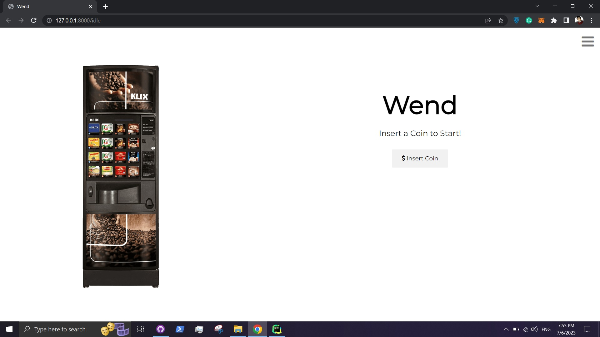

# Wend

Vending Machine, developed with [Django](https://github.com/django/django).

## documentation

documentation including class diagram, database relational schema, ER diagram and sequence diagram are available at `doc/`.

## how to run

Run `python manage.py runserver` to start development server on `http://localhost:8000/`.

Run `python manage.py test` to execute tests.

## how to run with docker

Run `docker run --rm -p 8001:8001 wend` to start development server on `http://localhost:8001/`.
